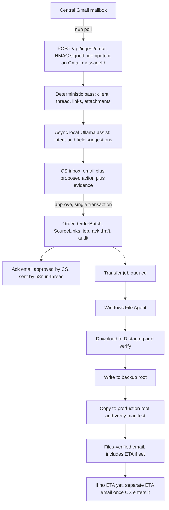
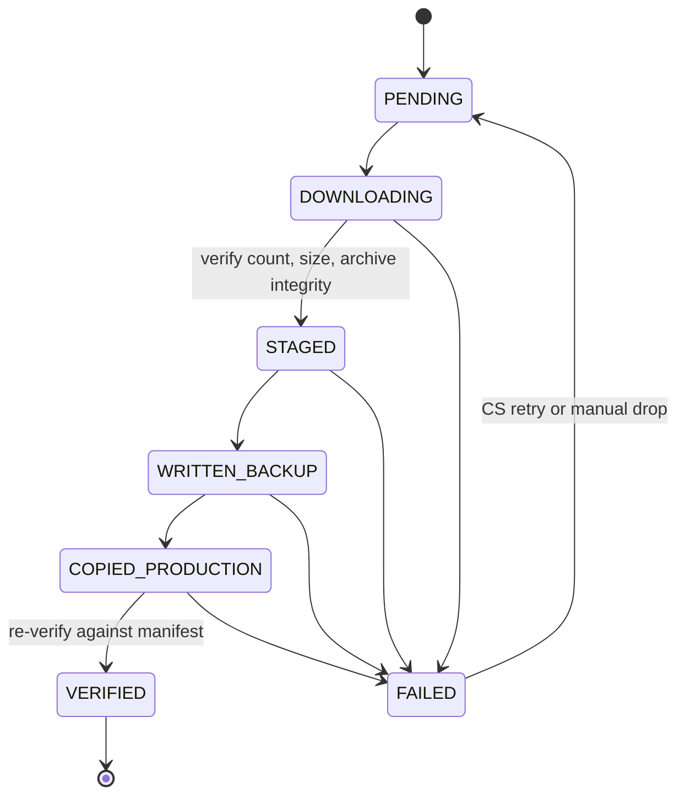

# CS Automation Design Spec

**Date:** 2026-07-26  
**Status:** Approved for Phase 0 implementation  
**Scope of this document:** Full system design. Implementation proceeds one phase at a time.

## Confirmed environment

Verified directly on the machine, not assumed:

- Single on-prem box `TUDB01`: i5-10400, 32 GB RAM, Windows 10 Pro 22H2.
- Installed: PostgreSQL 18.4, Git 2.54, Node 24 / npm 12, Ollama 0.32 with `qwen3:8b` and `qwen3-embedding:0.6b`. No Docker.
- Local disks: `C:` 57.3 GB free (SSD, OS + database), `D:` 278.4 GB free, `E:` 174.9 GB free, `F:` 59.2 GB free.
- Share mappings:
  - `X:` (backup) = `\\192.168.0.15\Production\File Transfer Server`
  - `Z:` (production) = `\\192.168.0.15\Production\File Server`
- MVP target roots, confirmed to exist:
  - Backup: `X:\Sifat_Project Coordinator\Software test\_Software Test`
  - Production: `Z:\_Share Work\2026\_Software Test`
- Existing structure under both roots is `<ClientCode>\<OrderFolder>`, with a reserved `_Final Done` folder per client. Observed client codes: `DPBP`, `FN`, `Vrly`.
- Order files are large: individual TIFs run 100-330 MB, so a 22-file order is typically 3-5 GB.
- Volume: 20-100 emails and 5-20 orders per day.

## Findings that shaped the design

- **X: and Z: are the same physical server and the same share.** The backup is not independent; if `192.168.0.15` fails, both copies are lost. Raise with infrastructure. It also means a same-server SMB copy may be offloaded server-side, which must be benchmarked.
- **Neither share root is a clean order archive.** Both contain staff scratch folders, Photoshop `.atn` files, loose TIFs, and debris. The agent must own a dedicated namespaced root and never write to or touch the share root.
- **A Windows service cannot see mapped drive letters.** Drive letters are per-user session mappings. Both services must use UNC paths and run under an account with share permissions, never LocalSystem.
- **The GT 1030 (2 GB VRAM) cannot host the model.** Inference is CPU-only at roughly 3-6 tokens/sec, so AI must be asynchronous and advisory.
- **Path length is a real failure mode.** The backup UNC root is already 102 characters and client filenames run 40+. Nested archive folders will breach the 260-character `MAX_PATH` limit unless the agent uses extended-length `\\?\UNC\` paths and caps generated names.
- **Client codes are ad hoc.** `DPBP`, `FN`, `Vrly` were invented per client with no registry, so the system must become the authority for code-to-folder-to-sender mapping.

## Architecture

Five processes on one box, no containers: the Next.js app, PostgreSQL 18, n8n installed via npm as a Windows service, Ollama, and the File Agent as a second Windows service.

The trust model is the core of the design. PostgreSQL is the only source of truth. n8n is transport for Gmail and Sheets and owns no business state. Ollama is advisory and its output cannot reach the filesystem or an outbound email without human approval. The File Agent is the only component that touches the shares and acts solely on jobs the app has authorised. n8n and the agent authenticate to the app with a shared secret and HMAC-signed payloads over localhost.

The backup root is a single config value, so the planned move to a new backup server becomes a config change plus a one-time copy.

Because CPU inference is slow, the inbox never waits on the model. The deterministic rule-based proposal is written and visible immediately, and the model's refinement is applied when it completes, so CS can act on an email before the model has looked at it. Inference never sits in a request path.

## Components

- `packages/shared` — pure logic, no I/O: Zod contracts, order and batch state machines, the path builder (sanitisation, length cap, `\\?\UNC\` emission, traversal rejection), HMAC signing, and password hashing. Highest-risk logic, fully unit-testable offline.
- `packages/db` — Prisma schema, migrations, generated client.
- `apps/web` — ingest endpoint, review inbox, order management, agent job API, outbound email approval queue.
- `apps/file-agent` — job loop, download adapters (Dropbox, Google Drive, manual drop), staging verifier, share writer, transfer verifier. Filesystem access sits behind a port interface so tests run against a temp directory.

## Data model

- `Client` — unique code, display name, exact on-disk folder name, sender addresses and domains. Creation flow lists folders already present under the root so CS binds to an existing folder instead of creating a near-duplicate.
- `Order` — canonical code, client, title, type, quantity, status, ETA, Gmail thread ID, resolved backup and production paths.
- `OrderBatch` — kind `INITIAL | ADDITIONAL | SAMPLE | CORRECTION`, attached to one order. This single mechanism absorbs additional files, sample rounds, late instructions, and post-submission corrections, and lets an order be in production while a correction batch is still downloading.
- `SourceLink` — per batch: Dropbox, Drive, attachment, or manual drop.
- `EmailMessage` — unique on Gmail message ID, with thread ID, direction, participants, body, and triage status.
- `Proposal` — what the rules and the model suggested, with confidence, provenance `RULE | LLM`, and who accepted or rejected it.
- `TransferJob` — leased queue row: kind, attempts, lease expiry, owner, byte progress, last error, retryable flag.
- `FileArtifact` — relative path, size, and checksum per stage; the manifest that makes verification real.
- `OutboundEmail` — draft, template, approver, idempotency key, Gmail thread and sent message ID.
- `User`, `Session`, `AuditEvent` (append-only).

Order status and batch status are separate: the order tracks the client relationship, the batch tracks file movement.

## Naming convention

Order folders are created as `VRLY_260726_001__kirkland_spring_drop`: a machine-identity prefix plus a human-readable suffix. The agent resolves folders by prefix, so a human renaming the descriptive tail does not break automation, and a hidden `.cs-order.json` marker inside each order folder records the order ID so the binding survives a full rename.

`_Final Done` is reserved per client and must never be treated as an order folder.

## Client communication

Two messages, both drafted by the app and sent by n8n only after CS approval, always in the existing Gmail thread:

1. **Acknowledgement**, immediately on intake approval and before download starts, so the client is never left waiting through a multi-gigabyte transfer or a broken link.
2. **Files received and verified**, after production is verified, including the ETA if one has been entered by then.

If no ETA exists at that point the order enters `AWAITING_ETA` and a separate ETA message is drafted once CS records the production head's commitment.

## Transfer pipeline

Jobs are leased with `SELECT ... FOR UPDATE SKIP LOCKED` and a heartbeat-extended lease. Staging is `D:\cs-staging` (278 GB free; `C:` at 57 GB free is too tight). Nothing partial reaches the shares. Writing into the backup path refuses to overwrite an existing folder. Free space is checked on both staging and destination before a transfer begins.

Never reference `X:` or `Z:` in code or configuration. Use UNC only:

- Backup: `\\192.168.0.15\Production\File Transfer Server\Sifat_Project Coordinator\Software test\_Software Test`
- Production: `\\192.168.0.15\Production\File Server\_Share Work\2026\_Software Test`

## Failure handling

Transient failures — network drops, SMB timeouts, 429 and 5xx — retry with exponential backoff to a capped attempt count. Permanent failures — dead link, permission-denied share, corrupt archive, path too long, target folder exists — stop immediately and notify CS.

Every stage is idempotent and re-derives its state on resume. Source and staging data are never deleted before verification passes. When a download fails permanently, CS points the batch at a manually filled folder and the pipeline resumes from the verification stage.

## Testing

- Unit: path builder against sanitisation, the 260-character cap, traversal attempts; every state transition including rejected ones; HMAC verification; model output validator fed malformed responses.
- Integration: ingest idempotency with a repeated Gmail message ID, thread correlation, the all-or-nothing approval transaction, two agent loops racing for one job.
- File operations against a temp directory standing in for the share: overwrite refusal, crash resumption, corrupted verification detection, long-path handling.
- Security: unauthenticated and badly signed ingest rejected, role checks on every approval endpoint, path traversal via client name.
- One real end-to-end run inside the `_Software Test` folders before anything points at live paths.

## Review model

Inbox of unhandled emails, each with a pre-filled proposed action and visible evidence (rules first, model refinement async). CS_EXECUTIVE and CS_LEAD roles; CS_LEAD can manage users and read the audit trail.

## Phased roadmap

| Phase | Branch                        | Delivers                                                  |
| ----- | ----------------------------- | --------------------------------------------------------- |
| 0     | `feature/project-foundation`  | Repo, auth, audit, CI, copy benchmark                     |
| 1     | `feature/manual-order-intake` | Client registry, Order/Batch, path builder, manual create |
| 2     | `feature/file-agent`          | Job queue, UNC transfers, Windows service                 |
| 3     | `feature/gmail-integration`   | n8n Gmail poll, review inbox, approved emails             |
| 4     | `feature/ai-assistance`       | Local Ollama assist behind extractor interface            |
| 5     | `feature/google-sheets-sync`  | One-way Postgres → Sheets mirror                          |

## Open risks

- Google Sheets cutover: production head reads the sheet; mirror must ship before go-live.
- X: is not an independent backup (same server/share as Z:).
- Pixofix portal API availability unknown.
- Dropbox and Google Drive credentials for authenticated links not yet available.
- Model sizing: at confirmed volume, `qwen3:8b` on CPU is ~1 minute per classification; bake-off against `qwen3:4b` required.
- UNC-capable service account not yet provisioned.
- `C:` has only 57 GB free and needs monitoring once the database is live.
- App initially on plain HTTP on the LAN; HTTPS required before broader use.
