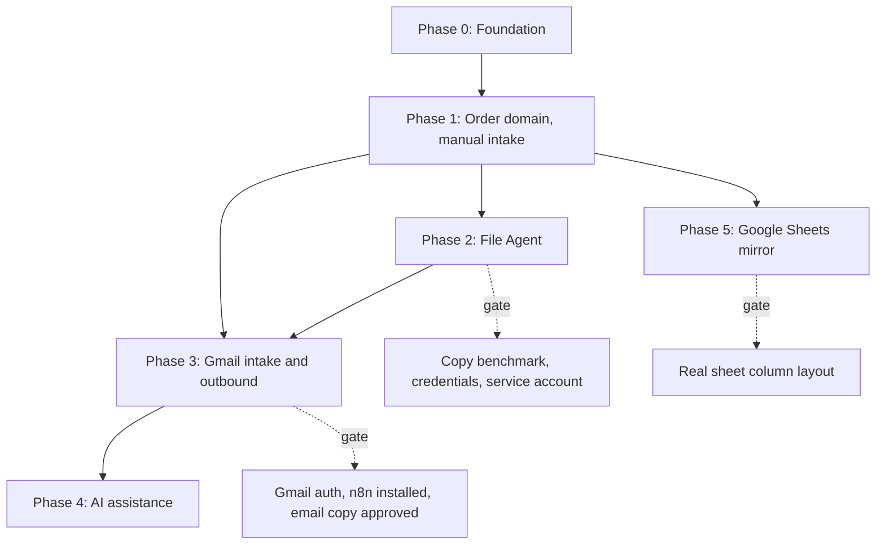

# CS Automation Implementation Roadmap, Phases 0 to 5

> **For agentic workers:** Execute one phase at a time, task by task, in order. Steps use checkbox (`- [ ]`) syntax. Each phase ends with a green `npm run verify` and a merge into `develop`. Do not start a phase whose Entry Gate is unmet; report the unmet gate and stop.

**Goal:** Automate Client Support order intake from Gmail through verified file placement on the backup and production shares, with human approval on every client-facing action, and mirror order state to the existing Google Sheet.

**Architecture:** Five processes on one on-prem Windows box. PostgreSQL is the sole source of truth. n8n is transport only. Ollama is advisory only. A Windows File Agent is the only component that touches the shares. Human approval gates intake, outbound email, and ETA.

**Tech Stack:** Node 24, TypeScript strict, Next.js App Router, Tailwind, Prisma, PostgreSQL 18, Zod, `@node-rs/argon2`, Vitest, n8n, Ollama, GitHub Actions.

## How to use this document

- Sections marked CONTRACT are binding across phases. Changing them requires a new ADR.
- Phases 1 and 2 carry task-level detail sufficient to implement directly.
- Phases 3, 4, and 5 carry an Entry Gate. Phase 3 task-level detail lives in
  `docs/superpowers/plans/2026-07-26-cs-automation-phase-3.md`. Phases 4 and 5 still use outlines
  until their gates clear. Do not invent gated inputs (email copy, sheet columns, etc.).
- Every phase assumes the Global Constraints below without repeating them.

## Global Constraints

- Windows 10 Pro, PowerShell 5.1. `&&` is a parse error. Chain with `;`.
- Never reference `X:` or `Z:` in code or configuration. UNC only. Backup root `\\192.168.0.15\Production\File Transfer Server\Sifat_Project Coordinator\Software test\_Software Test`, production root `\\192.168.0.15\Production\File Server\_Share Work\2026\_Software Test`.
- Staging is `D:\cs-staging`. `C:` has 57 GB free and holds the database.
- All persisted timestamps are UTC `timestamptz(6)`.
- TypeScript `strict`, `noUncheckedIndexedAccess`, `exactOptionalPropertyTypes`. `@typescript-eslint/no-explicit-any` is an error. Never weaken these to make something compile.
- No secrets in the repository. Only `.env.example` is committed.
- Never log passwords, tokens, session identifiers, HMAC secrets, or client file contents.
- Every task ends with a Conventional Commit.
- `_Final Done` is reserved per client and is never an order folder.
- Docker is not installed and must not be required.

## Phase dependency graph



Phase 5 depends only on Phase 1 because the mirror projects order state. It may ship before Phase 3 if production needs visibility sooner, and the roadmap deliberately allows that reordering.

## CONTRACT: canonical identifiers

- **Order code** is `CLIENTCODE_YYMMDD_NNN`, uppercase client code, two-digit year, `NNN` zero-padded, sequence scoped per client per calendar day in UTC. Example `VRLY_260726_001`.
- **Order folder name** is the order code, then `__`, then a sanitised human suffix derived from the order title. Example `VRLY_260726_001__kirkland_spring_drop`. The suffix is cosmetic; resolution is always by the `CLIENTCODE_YYMMDD_NNN` prefix.
- **Marker file** `.cs-order.json` sits in every order folder containing `orderId`, `orderCode`, `clientCode`, `createdAtUtc`, and `schemaVersion: 1`. It is the authoritative binding if a human renames the folder.
- **Batch subfolder** is `<sequence>_<KIND>` inside the order folder, for example `02_ADDITIONAL`. The initial batch is `01_INITIAL`.
- **Correlation ID** is a UUID generated at the entry point of every operation and threaded through every audit and log line for that operation.

## CONTRACT: order and batch lifecycles

Order status, owned by the client relationship (Phase 4 rewrite): `UNASSIGNED`, `IN_PRODUCTION`, `READY_TO_UPLOAD`.

Legal order transitions: `UNASSIGNED` to `IN_PRODUCTION`; `IN_PRODUCTION` to `READY_TO_UPLOAD`; `READY_TO_UPLOAD` is terminal. There is no Cancel transition. ETA is not a status — it is a locked field with derived tags `ETA Required` and `ETA Sent`.

Batch status, owned by file movement: `PENDING`, `DOWNLOADING`, `STAGED`, `WRITTEN_BACKUP`, `COPIED_PRODUCTION`, `VERIFIED`, `FAILED`, `CANCELLED`. Transitions follow the pipeline order; any non-terminal state may go to `FAILED`; `FAILED` may return to `PENDING` on operator retry; `VERIFIED` and `CANCELLED` are terminal.

An order may hold multiple batches in different states simultaneously. An order in `IN_PRODUCTION` with a `CORRECTION` batch in `DOWNLOADING` is normal and must not be treated as an error.

## CONTRACT: interfaces between phases

- Phase 1 produces `@cs/shared` exports `buildOrderCode`, `buildOrderFolderName`, `sanitisePathSegment`, `toExtendedLengthPath`, `joinUncPath`, `assertPathBudget`, `orderTransition`, `batchTransition`. Phase 2 consumes all of them and adds none.
- Phase 1 produces Prisma models `Client`, `ClientIdentity`, `Order`, `OrderBatch`, `SourceLink`, `OrderEvent`. Phase 2 adds `TransferJob` and `FileArtifact` only. Phase 3 adds `EmailMessage`, `Proposal`, `OutboundEmail` only. Phase 5 adds `SheetMirrorOutbox` only.
- Phase 2 produces the agent HTTP contract at `/api/agent/jobs/lease`, `/api/agent/jobs/:id/progress`, `/api/agent/jobs/:id/complete`, `/api/agent/jobs/:id/fail`, all HMAC-signed with the Phase 0 `signRequest` and `verifyRequest`.
- Phase 3 produces `/api/ingest/email`, idempotent on Gmail `messageId`, plus `/api/outbound/pending` and `/api/outbound/:id/sent`.
- Phase 4 produces the local AI orchestrator (`apps/web/src/lib/ai/`), three-status order lifecycle, and system auto-send for confirmation / ETA / query / conversation templates under ADR 0009. Existing ingest and outbound endpoints remain; behaviour changes are additive.

---

# Phase 0: Foundation

**Branch:** `feature/project-foundation`
**Status:** complete. Merged into `develop` at `34ba7f1`; GitHub CI run `30186691982`
passed.
**Plan:** `docs/superpowers/plans/2026-07-26-cs-automation-phase-0.md`

Known plan defect corrected during execution: the root `tsconfig.json` referenced only
`./packages/shared` until Phase 0 Task 5 created `packages/db`.

**Exit criteria:** `npm run verify` green; a seeded `CS_LEAD` signs in and reaches `/dashboard`; `AuditEvent` rejects `UPDATE` and `DELETE` at the database level; session tokens stored only as SHA-256 hashes; CI workflow committed; copy benchmark recorded or explicitly deferred.

---

# Phase 1: Order domain and manual intake

**Branch:** `feature/manual-order-intake`
**Entry Gate:** Phase 0 merged to `develop`.

This phase proves the entire domain model, the path builder, and the state machines with zero external dependencies. Every later phase writes into these tables. Getting this wrong is the most expensive mistake available.

## Deliverable

A CS executive can create a client, create an order, add batches, record an ETA, and move the order through its lifecycle entirely by hand. No Gmail, no file movement, no AI. Every mutation is audited.

## Data model added

```prisma
model Client {
  id           String   @id @default(uuid()) @db.Uuid
  code         String   @unique
  displayName  String
  folderName   String   @unique
  isActive     Boolean  @default(true)
  createdAt    DateTime @default(now()) @db.Timestamptz(6)
  updatedAt    DateTime @updatedAt @db.Timestamptz(6)

  identities ClientIdentity[]
  orders     Order[]
}

enum ClientIdentityKind { ADDRESS  DOMAIN }

model ClientIdentity {
  id       String             @id @default(uuid()) @db.Uuid
  clientId String             @db.Uuid
  client   Client             @relation(fields: [clientId], references: [id], onDelete: Cascade)
  kind     ClientIdentityKind
  value    String
  @@unique([kind, value])
  @@index([clientId])
}

enum OrderStatus {
  DRAFT  ACKNOWLEDGED  AWAITING_ETA  ETA_SENT  IN_PRODUCTION  CLOSED  CANCELLED
}

model Order {
  id             String      @id @default(uuid()) @db.Uuid
  code           String      @unique
  clientId       String      @db.Uuid
  client         Client      @relation(fields: [clientId], references: [id])
  title          String
  orderType      String
  quantity       Int?
  status         OrderStatus @default(DRAFT)
  eta            DateTime?   @db.Timestamptz(6)
  etaNote        String?
  gmailThreadId  String?     @unique
  folderName     String
  backupPath     String
  productionPath String
  cancelReason   String?
  createdById    String      @db.Uuid
  createdAt      DateTime    @default(now()) @db.Timestamptz(6)
  updatedAt      DateTime    @updatedAt @db.Timestamptz(6)

  batches OrderBatch[]
  events  OrderEvent[]

  @@index([status])
  @@index([clientId, createdAt])
}

enum OrderBatchKind   { INITIAL  ADDITIONAL  SAMPLE  CORRECTION }
enum OrderBatchStatus {
  PENDING  DOWNLOADING  STAGED  WRITTEN_BACKUP  COPIED_PRODUCTION  VERIFIED  FAILED  CANCELLED
}

model OrderBatch {
  id            String           @id @default(uuid()) @db.Uuid
  orderId       String           @db.Uuid
  order         Order            @relation(fields: [orderId], references: [id], onDelete: Cascade)
  sequence      Int
  kind          OrderBatchKind
  status        OrderBatchStatus @default(PENDING)
  subfolder     String
  notes         String?
  failureReason String?
  createdById   String           @db.Uuid
  createdAt     DateTime         @default(now()) @db.Timestamptz(6)
  updatedAt     DateTime         @updatedAt @db.Timestamptz(6)

  sourceLinks SourceLink[]

  @@unique([orderId, sequence])
  @@index([status])
}

enum SourceLinkKind { DROPBOX  GDRIVE  ATTACHMENT  MANUAL_DROP  OTHER }

model SourceLink {
  id        String         @id @default(uuid()) @db.Uuid
  batchId   String         @db.Uuid
  batch     OrderBatch     @relation(fields: [batchId], references: [id], onDelete: Cascade)
  kind      SourceLinkKind
  url       String?
  localHint String?
  addedById String         @db.Uuid
  createdAt DateTime       @default(now()) @db.Timestamptz(6)
  @@index([batchId])
}

model OrderEvent {
  id            String   @id @default(uuid()) @db.Uuid
  orderId       String   @db.Uuid
  order         Order    @relation(fields: [orderId], references: [id], onDelete: Cascade)
  batchId       String?  @db.Uuid
  type          String
  payload       Json     @default("{}")
  actorUserId   String?  @db.Uuid
  actorLabel    String
  correlationId String   @db.Uuid
  occurredAt    DateTime @default(now()) @db.Timestamptz(6)
  @@index([orderId, occurredAt])
}
```

`OrderEvent` gets the same append-only `BEFORE UPDATE OR DELETE` trigger used for `AuditEvent` in Phase 0. Reuse the existing `audit_event_append_only()` function rather than defining a second one.

## Tasks

### Task 1.1: Path and naming primitives in `packages/shared`

The highest-risk pure logic in the project. Build it first, in isolation, with no database.

**Files:** create `packages/shared/src/paths.ts` and `paths.test.ts`; modify `index.ts`.

**Produces:** `sanitisePathSegment`, `buildOrderCode`, `buildOrderFolderName`, `joinUncPath`, `toExtendedLengthPath`, `assertPathBudget`, `PathTraversalError`, `PathBudgetError`.

Behaviour that must be tested, each as its own case:

- Strips Windows-illegal characters and ASCII control characters.
- Collapses whitespace runs to a single `_`, trims leading and trailing `_`.
- Rejects `.` and `..` with `PathTraversalError`, including after sanitisation.
- Rejects reserved device names `CON PRN AUX NUL COM1-COM9 LPT1-LPT9`, case-insensitively, including with an extension such as `CON.txt`.
- Strips trailing dots and spaces, which Windows silently drops and which would otherwise produce a folder the agent cannot find by exact name later.
- Preserves non-ASCII letters rather than stripping them.
- Returns a fallback such as `untitled` when input sanitises to nothing.
- `buildOrderCode` pads to three digits, uppercases the client code, formats the date `YYMMDD` in UTC not local time.
- `buildOrderFolderName` truncates the suffix on a word boundary where possible and never leaves a trailing `_`.
- `toExtendedLengthPath` converts `\\host\share\a` to `\\?\UNC\host\share\a` and is idempotent.
- `joinUncPath` rejects any segment that would escape the root.
- `assertPathBudget` throws when root plus segments plus longest expected file name exceeds 260, naming the total in the message.

Use the real backup root in at least one budget test, because at 102 characters it is the actual constraint.

Commit: `feat(shared): add path building, sanitisation, and MAX_PATH budget checks`

### Task 1.2: State machines in `packages/shared`

**Files:** create `packages/shared/src/lifecycle.ts` and `lifecycle.test.ts`; modify `index.ts`.

**Produces:** `orderTransition`, `batchTransition`, `assertOrderTransition`, `assertBatchTransition`, `IllegalTransitionError`, and literal union types matching the Prisma enums exactly.

Test every legal transition passes and a representative set of illegal ones fails: `CLOSED` to `DRAFT`, `CANCELLED` to anything, `DRAFT` straight to `IN_PRODUCTION`, `VERIFIED` back to `DOWNLOADING`. Add a parity test that imports the Prisma enum and asserts set equality with the union, so adding a status to the schema without updating the machine fails the build.

Commit: `feat(shared): add order and batch lifecycle state machines`

### Task 1.3: Domain schema migration

**Files:** modify `packages/db/prisma/schema.prisma`; create the migration; create `packages/db/src/domain-immutability.test.ts`; update `resetDatabase` to truncate the new tables in dependency order.

Tests: `OrderEvent` refuses update and delete; `Order.code` uniqueness enforced; `ClientIdentity` uniqueness on `(kind, value)` enforced; deleting a `Client` with orders is refused by the foreign key while a client with only identities cascades.

Commit: `feat(db): add client, order, batch, source link, and order event schema`

### Task 1.4: Client registry service

**Files:** create `apps/web/src/lib/clients/service.ts` and its test.

**Produces:** `createClient`, `resolveClientByEmail`, `listUnboundFolders`.

`resolveClientByEmail` tries an exact address match first, then a domain match, and returns null rather than guessing. `listUnboundFolders` lists directories directly under the backup root so the UI offers existing folders instead of creating near-duplicates, excluding `_Final Done`.

Tests: exact address beats domain when both match; matching is case-insensitive; unknown sender returns null; a client code differing only by case is rejected; `listUnboundFolders` excludes `_Final Done` and files.

Commit: `feat(orders): add client registry with email and domain resolution`

### Task 1.5: Order creation with safe sequence allocation

**Files:** create `apps/web/src/lib/orders/create.ts` and its test.

The sequence allocation is the subtle part. Two executives creating orders for the same client in the same second must not collide. Compute the sequence inside the transaction that inserts the order, and treat the `Order.code` unique index as the real guarantee, retrying on a P2002 unique violation up to three times with the sequence recomputed each attempt. Counting alone is not safe.

`createOrder` computes the code, folder name, and both absolute UNC paths, calls `assertPathBudget`, creates the order, creates batch sequence 1 as `INITIAL`, creates the source links, and writes an `OrderEvent` and an `AuditEvent`, all in one transaction.

Tests: concurrent creation for one client on one day yields `_001` and `_002` with no duplicate; a title that sanitises to empty still produces a valid folder name; a title long enough to breach the path budget is rejected before any row is written; the transaction rolls back completely if the budget check throws.

Commit: `feat(orders): add transactional order creation with per-client daily sequencing`

### Task 1.6: Batch management and lifecycle services

**Files:** create `apps/web/src/lib/orders/batches.ts` and `lifecycle.ts` with tests.

**Produces:** `addBatch`, `setOrderStatus`, `setBatchStatus`, `setEta`. Each validates through the Task 1.2 state machine and writes an event and an audit entry in the same transaction.

Tests: adding a batch to a `CANCELLED` order is refused; an illegal status change is refused and writes no event; a `CORRECTION` batch can be added while the order is `IN_PRODUCTION`; an ETA earlier than now is refused.

Commit: `feat(orders): add batch management and lifecycle transitions`

### Task 1.7: Manual intake UI

**Files:** client list and create pages, order list, order create, order detail under `apps/web/src/app/(app)/`, each with `loading.tsx` and `error.tsx`.

Non-negotiable requirements:

- Every list has a loading skeleton with reserved height, an explicit empty state explaining the next action, and an error state that does not print raw exception text.
- Every submit button disables and shows in-progress text while pending.
- The order create form previews the resulting folder name live, so the executive sees `VRLY_260726_001__kirkland_spring_drop` before saving.
- The order detail page shows batches with status, source links, the ETA, and the full `OrderEvent` timeline.
- Only `CS_LEAD` reaches client management, enforced with `assertCan` server-side, not by hiding the link.

Add two permissions to `rbac.ts`: `client:manage` for `CS_LEAD`, `order:write` for both roles.

Commit: `feat(web): add manual client and order management UI`

### Task 1.8: Phase 1 verification

Run `npm run verify`. Manually create a client bound to an existing folder, create an order, add an `ADDITIONAL` batch, set an ETA, and walk the order to `CLOSED`. Confirm the timeline records every step with the acting user. Update `docs/implementation-status.md`. Open a pull request into `develop`.

## Phase 1 acceptance criteria

- An order cannot exist without a resolvable client and a path-budget-checked folder name.
- Two concurrent creations never produce the same order code.
- Illegal lifecycle transitions are impossible through the service layer.
- Every mutation produces an `OrderEvent` and an `AuditEvent` in the same transaction as the change.
- No filesystem write occurs anywhere in this phase. Paths are computed and stored, not created.

---

# Phase 2: Windows File Agent

**Branch:** `feature/file-agent`
**Status:** complete and code-review hardened on the feature branch. Live 2 GiB verification and
killed-agent recovery
passed under the explicitly approved interim `TUDB01\Designer-TUUO` identity. Production service
activation remains gated on IT provisioning `.\CS_FileAgent` (or an approved domain equivalent).
**Entry Gate:** all three must hold.

- The copy benchmark has run and `docs/benchmarks/2026-07-26-smb-copy-strategy.md` records whether `Copy-Item` or `robocopy` wins on this hardware.
- A Windows service account with read and write permission to `\\192.168.0.15\Production` exists and its credentials are available to the operator.
- A decision exists on Dropbox and Drive credentials. If none are available the phase proceeds with public-link and manual-drop adapters only, and records that limitation.

## Deliverable

An approved batch is downloaded, verified in staging, written to the backup root, copied to production, verified against a manifest, and marked `VERIFIED`, with progress visible in the UI and safe recovery from a mid-transfer crash.

## Data model added

`TransferJob`: `batchId`, `kind` in `DOWNLOAD | STAGE_VERIFY | WRITE_BACKUP | COPY_PRODUCTION | VERIFY_PRODUCTION`, `status` in `QUEUED | LEASED | SUCCEEDED | FAILED`, `attempts`, `maxAttempts`, `leaseOwner`, `leaseExpiresAt`, `lastError`, `errorClass` in `TRANSIENT | PERMANENT`, `bytesTotal`, `bytesDone`, `correlationId`. Unique on `(batchId, kind)` so a stage cannot be double-queued.

`FileArtifact`: `batchId`, `relativePath`, `sizeBytes`, `sha256`, `stage` in `STAGED | BACKUP | PRODUCTION`. Unique on `(batchId, stage, relativePath)`. This manifest is what makes verification real rather than assumed.

## Tasks

### Task 2.1: Job queue with lease semantics

Implement `leaseNextJob` using `SELECT ... FOR UPDATE SKIP LOCKED` over jobs that are `QUEUED` or `LEASED` with an expired lease, plus `heartbeat`, `completeJob`, and `failJob`. `failJob` decides between requeue and terminal failure based on `errorClass` and `attempts`.

The test that matters: two concurrent leases against one queued job, exactly one wins. Also assert an expired lease is reclaimable and a `PERMANENT` failure never requeues regardless of remaining attempts.

Commit: `feat(agent): add leased transfer job queue`

### Task 2.2: Agent HTTP contract

Add the four HMAC-signed endpoints from the interface contract. Reject unsigned requests, bad signatures, and stale timestamps using the Phase 0 `verifyRequest`. These endpoints are machine-only and must not accept a session cookie as an alternative credential, because that would let any logged-in browser drive the agent. Test the rejection paths explicitly, including a replayed signature outside the tolerance window.

Commit: `feat(agent): add HMAC-signed agent job API`

### Task 2.3: Filesystem port and adapters

Define `FileSystemPort` with `ensureDirectory`, `writeStream`, `listFiles`, `stat`, `move`, `copyTree`, `remove`, `freeSpaceBytes`. Provide a real implementation using extended-length paths and a temp-directory implementation for tests. All later filesystem logic depends only on the port, which is what makes this phase testable without touching the live share.

Commit: `feat(agent): add filesystem port with extended-length path support`

### Task 2.4: Download adapters

- `DropboxPublicAdapter` rewrites `?dl=0` to `?dl=1` and streams the response, treating an HTML login page in the body as a `PERMANENT` failure rather than saving it as a corrupt archive. This failure is common and silently produces a small file named like a zip.
- `GoogleDriveAdapter` uses the Drive API when credentials exist, otherwise reports `PERMANENT` with a message directing the operator to manual drop.
- `ManualDropAdapter` reads from `D:\cs-staging\manual\<batchId>` and requires an operator confirmation flag on the batch before proceeding.

Every adapter streams to disk; none loads a file into memory. Test against a fake HTTP server including a truncated response and an HTML-instead-of-binary response.

Commit: `feat(agent): add Dropbox, Drive, and manual drop download adapters`

### Task 2.5: Staging verification and manifest

Verify staged content before it goes near the shares: reject zero-byte files, validate archive integrity, expand archives into the batch folder, compute the `FileArtifact` manifest with SHA-256, and enforce that no expanded path breaches the path budget for the destination root. That last check prevents a client-supplied nested folder from producing an unwritable destination. Test with a deliberately deep archive.

Commit: `feat(agent): add staging verification and file manifest`

### Task 2.6: Backup write and production copy

Write from staging to `<backupRoot>\<clientFolder>\<orderFolder>\<batchSubfolder>`. Refuse outright if the destination exists and is non-empty: that is a `PERMANENT` failure requiring a human, never an overwrite. Write `.cs-order.json` into the order folder if absent. Copy to production using whichever method the benchmark selected, then re-verify against the manifest by size and checksum. Check free space on staging and destination before either step.

Test against the temp-directory port: overwrite refusal, resume after a simulated crash between backup and production, and detection of a deliberately corrupted file at production verification.

Commit: `feat(agent): add backup write, production copy, and manifest verification`

### Task 2.7: Agent process and Windows service

Create `apps/file-agent` as a loop that leases, executes, heartbeats, and reports. Configuration comes from the Phase 0 validated environment, so a drive-letter root fails at startup rather than at first transfer. Provide an install script using NSSM or `node-windows` running under the share-permitted account, plus a documented uninstall. Record in `docs/architecture.md` that the service must not run as LocalSystem, and why.

Commit: `feat(agent): add file agent process and Windows service installer`

### Task 2.8: Transfer monitoring UI

Show per-batch stage, byte progress, attempt count, and last error on the order detail page, with a retry action for `FAILED` batches and a manual-drop action for permanent download failures. Poll on a five-second interval rather than holding a socket open; transfers run for minutes.

Commit: `feat(web): add transfer progress and retry controls`

### Task 2.9: Phase 2 verification

Run a real end-to-end transfer of a multi-gigabyte order inside the `_Software Test` roots only. Record throughput. Confirm the marker file lands, the manifest matches, and a killed agent resumes cleanly.

## Phase 2 acceptance criteria

- No partial or unverified content ever appears under either root.
- An existing destination folder is never overwritten.
- A killed agent resumes without duplicating work or losing the batch.
- Transient and permanent failures are distinguished, and permanent failures stop rather than retry.
- Every Node filesystem path written is an extended-length UNC path. Robocopy receives validated
  normal UNC only at its process boundary per ADR 0006 because the deployed Windows robocopy
  rejects `\\?\UNC\...`; `/256` remains disabled and SHA-256 verification is mandatory.

---

# Phase 3: Gmail intake and outbound

**Branch:** `feature/gmail-integration`
**Status:** implemented and locally verified; live n8n/OAuth/template activation remains gated.
**Plan:** `docs/superpowers/plans/2026-07-26-cs-automation-phase-3.md`

**Entry Gate:** Phase 2 merged to `develop`; n8n installed as a Windows service; Gmail OAuth completed for the shared mailbox; exact wording approved for `ACKNOWLEDGEMENT`, `FILES_VERIFIED`, and `ETA_NOTICE`. Do not invent the email copy. If any gate item fails, stop and report it.

## Deliverable

New mail appears in a CS review inbox with a pre-filled rule-based proposed action and visible evidence. Approving creates or updates an order in one transaction, queues the Phase 2 transfer job, and drafts the acknowledgement. Approved drafts are sent by n8n in the original thread. No AI in this phase.

## Data model added

`EmailMessage`, `Proposal`, and `OutboundEmail` only — full Prisma shapes, enums, APIs, tasks, and TDD requirements live in the dedicated Phase 3 plan.

## Phase 3 acceptance criteria

- A replayed Gmail message never creates a second order (and never a second Proposal).
- No email is sent without a recorded human approval.
- Every sent message carries the correct `gmailThreadId`.
- An email resolving to no client reaches the inbox as `NEEDS_HUMAN` rather than being dropped.

---

# Phase 4: Local AI assistance

**Branch:** `feature/ai-assistance`
**Entry Gate:** Phase 3 merged and running on real mail for at least one week, so a corpus of real emails exists. Evaluating a classifier on invented emails is worthless.

## Deliverable

The review inbox shows model-suggested intent and fields alongside the rule-based proposal, with confidence, and never blocks on inference.

## Task outline

1. Define `OrderExtractor` with one method taking a normalised email and returning a validated `ExtractionResult`. Ship the existing Phase 3 rule logic behind the same interface, so the model is an addition rather than a replacement.
2. `OllamaExtractor` calling the local endpoint with a JSON-schema-constrained prompt, a hard timeout, and Zod validation. Malformed or timed-out responses are discarded and logged as a miss, never surfaced.
3. Asynchronous execution: a worker enriches proposals after the fact and updates the row. The inbox renders whatever exists at page load.
4. Bake-off harness comparing `qwen3:4b` and `qwen3:8b` against at least fifty labelled real emails, measuring intent accuracy and wall-clock latency, written to `docs/benchmarks/`.
5. Surface confidence and provenance in the UI and record acceptance rate, so the model's value is measurable rather than assumed.

## Phase 4 acceptance criteria

- Inference never appears in a request path.
- A malformed model response degrades to rule-only with no user-visible error.
- Model output cannot reach the filesystem or an outbound email without human approval.
- The bake-off result, not preference, selects the default model.

---

# Phase 5: Google Sheets mirror

**Branch:** `feature/google-sheets-sync`
**Entry Gate:** the real sheet's exact column layout, tab name, and header row captured in `docs/integrations/google-sheet-layout.md`. Do not guess the columns.

This phase may be pulled ahead of Phases 3 and 4 if production needs visibility of app-created orders sooner. It depends only on Phase 1.

## Deliverable

Every order state change appears in the existing sheet without a human retyping it, one-way, with the database remaining authoritative.

## Task outline

1. `SheetMirrorOutbox` holding `orderId`, `operation`, `payload`, `status`, `attempts`, `lastError`, `dispatchedAt`. Writing to the outbox happens inside the same transaction as the order change, which is what guarantees the mirror cannot silently miss an update.
2. A projection mapping an `Order` to the sheet's exact column order, unit-tested against the captured layout.
3. `GET /api/mirror/pending` and `POST /api/mirror/:id/done` for n8n, HMAC signed.
4. An n8n workflow appending or updating rows keyed on the order code, with the code written into a dedicated column so updates target the right row.
5. A reconciliation command reporting rows present in the database but missing from the sheet, for operator use after an outage.

## Phase 5 acceptance criteria

- The sheet never becomes a write source; conflicts resolve in favour of the database.
- A failed dispatch retries without duplicating a row.
- An order created while n8n is down still reaches the sheet once it returns.

---

# Assumptions requiring confirmation

These were unresolved at planning time. Each is implemented as stated; correcting one later is cheap, silently diverging from it is not.

- `Order.orderType` is free text mirroring the existing sheet column, not an enum, because the real service categories were not confirmed. If a fixed list exists it becomes a lookup table in a follow-up migration.
- `Order.quantity` is a nullable integer counting images.
- The order sequence `NNN` resets per client per UTC day.
- Client codes are uppercase alphanumeric, two to twelve characters.
- The initial batch is always created with the order, kind `INITIAL`, sequence 1.
- Both shares use the same client folder name; if they diverge, `Client` gains a second folder column.
- Session cookies run without `Secure` until HTTPS exists on the LAN.

# Cross-phase definition of done

A phase is complete when `npm run verify` is green, its acceptance criteria are demonstrably met, `docs/implementation-status.md` is updated, no secret has entered the repository, no functionality from a later phase has been implemented, and the branch is merged into `develop` behind a passing CI check.
