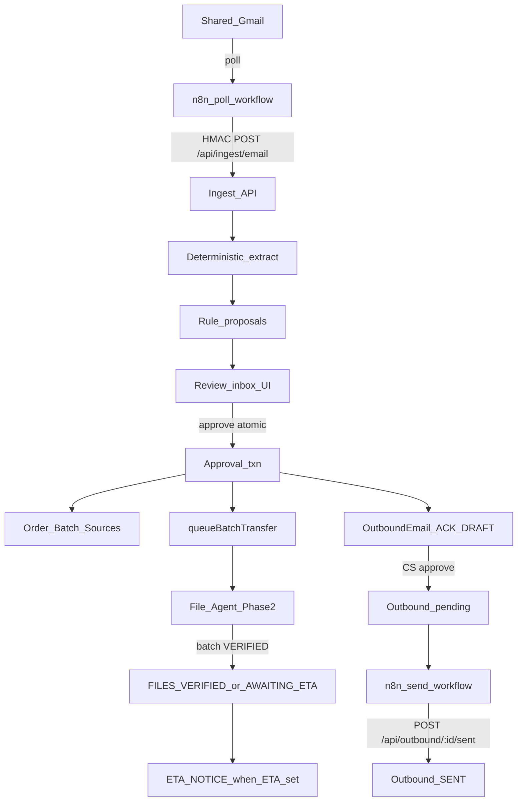

# CS Automation Phase 3 Implementation Plan

> **For agentic workers:** REQUIRED SUB-SKILL: Use superpowers:subagent-driven-development (recommended) or superpowers:executing-plans to implement this plan task-by-task. Steps use checkbox (`- [ ]`) syntax for tracking.

**Goal:** Bring new Gmail into a CS review inbox with a rule-based proposed action, let humans approve into an atomic order/batch/transfer/ack draft, and send only human-approved outbound mail in-thread via n8n — with zero AI and no invented client-facing copy.

**Architecture:** n8n is transport only (poll Gmail → HMAC ingest; poll outbound pending → send → mark sent). PostgreSQL remains the sole source of truth for triage, proposals, orders, and outbound state. Deterministic rules produce proposals immediately. File movement continues through the Phase 2 `queueBatchTransfer` path. Session cookies never authenticate machine routes.

**Tech Stack:** Existing monorepo (Node 24, TypeScript strict, Next.js App Router, Prisma, PostgreSQL 18, Zod, Vitest) plus n8n as a Windows service talking to localhost HMAC APIs.

**Parent roadmap:** `docs/superpowers/plans/2026-07-26-cs-automation-full-roadmap.md` (Phase 3 summary + contracts).
**Design:** `docs/specs/2026-07-26-cs-automation-design.md`.

## Global Constraints

- Windows 10 Pro, PowerShell 5.1. Never use `&&`; chain with `;`.
- UNC only. Never `X:` or `Z:`.
- All timestamps UTC `timestamptz(6)`.
- TypeScript `strict`, `noUncheckedIndexedAccess`, `exactOptionalPropertyTypes`. `@typescript-eslint/no-explicit-any` is an error.
- No secrets in the repository. Never log passwords, tokens, session IDs, HMAC secrets, or full client file contents.
- Conventional Commit after every task.
- **No AI / Ollama in this phase.** `Proposal.source` may store `LLM` for Phase 4 compatibility, but Phase 3 writers must only create `RULE` proposals.
- **Do not invent client email subject/body copy.** Templates use merge fields and `GATE_BLOCKED_PLACEHOLDER` until copy is approved and pasted into this plan under [Approved email copy](#approved-email-copy-gate-item-3).
- Live Gmail **send** must remain disabled (or fail closed) while placeholders remain.
- Phase 3 adds only Prisma models `EmailMessage`, `Proposal`, `OutboundEmail` (plus enums/relations). Do not add Phase 4/5 models.
- Reuse Phase 0 HMAC (`signRequest` / `verifyRequest`), Phase 1 `resolveClientByEmail` / order+batch services, Phase 2 `queueBatchTransfer`.

## Entry Gate (stop if any item fails)

Before creating `feature/gmail-integration` implementation commits:

| #   | Requirement                                                                      | Status                               |
| --- | -------------------------------------------------------------------------------- | ------------------------------------ |
| 0   | Phase 2 review-hardened branch merged into `develop`                             | Must verify                          |
| 1   | n8n installed and running as a Windows service                                   | Must verify                          |
| 2   | Gmail OAuth completed for the shared CS mailbox                                  | Must verify                          |
| 3   | Exact wording approved for `ACKNOWLEDGEMENT`, `FILES_VERIFIED`, and `ETA_NOTICE` | Must verify — see placeholders below |

If any item fails: report the unmet gate, update `docs/unresolved-questions.md`, and **stop**. Do not invent email copy. Do not implement Tasks 3.1–3.10.

**Implementation branch:** `feature/gmail-integration` cut from up-to-date `develop` after gate 0.

## Approved email copy (gate item 3)

Until owners paste approved text here, renderers must emit placeholders and outbound send must refuse production send.

| Template          | Subject                    | Body                       |
| ----------------- | -------------------------- | -------------------------- |
| `ACKNOWLEDGEMENT` | `GATE_BLOCKED_PLACEHOLDER` | `GATE_BLOCKED_PLACEHOLDER` |
| `FILES_VERIFIED`  | `GATE_BLOCKED_PLACEHOLDER` | `GATE_BLOCKED_PLACEHOLDER` |
| `ETA_NOTICE`      | `GATE_BLOCKED_PLACEHOLDER` | `GATE_BLOCKED_PLACEHOLDER` |

### Merge fields (allowed substitutions once copy exists)

- `ACKNOWLEDGEMENT`: `orderCode`, `clientDisplayName`, `title`
- `FILES_VERIFIED`: `orderCode`, `clientDisplayName`, `title`, `eta` (optional ISO or display string)
- `ETA_NOTICE`: `orderCode`, `clientDisplayName`, `eta`, `etaNote` (optional)

## Architecture



### Machine auth

- Extend `MACHINE_PATHS` in `apps/web/src/proxy.ts` to include `/api/ingest/` and `/api/outbound/` (session cookie must not satisfy these routes).
- Routes verify HMAC exactly like `apps/web/src/app/api/agent/jobs/**` using Phase 0 helpers.
- Reject unsigned, bad signature, and stale timestamp (replay window).

### RBAC (human UI)

- Review inbox and proposal decisions: `order:write` (`CS_EXECUTIVE`, `CS_LEAD`).
- Outbound draft approval: `order:write`.
- Do not grant machine HMAC callers any session role.

## Data model added

```prisma
enum EmailDirection { INBOUND  OUTBOUND }
enum EmailTriageStatus { UNREVIEWED  LINKED  IGNORED }
enum ProposalKind { CREATE_ORDER  ADD_BATCH  NO_ACTION  NEEDS_HUMAN }
enum ProposalSource { RULE  LLM }
enum ProposalStatus { PENDING  ACCEPTED  REJECTED  SUPERSEDED }
enum OutboundTemplate { ACKNOWLEDGEMENT  FILES_VERIFIED  ETA_NOTICE }
enum OutboundEmailStatus { DRAFT  APPROVED  SENDING  SENT  FAILED }

model EmailMessage {
  id              String            @id @default(uuid()) @db.Uuid
  gmailMessageId  String            @unique
  gmailThreadId   String
  direction       EmailDirection
  fromAddress     String
  toAddresses     String[]
  subject         String
  bodyText        String
  receivedAt      DateTime          @db.Timestamptz(6)
  clientId        String?           @db.Uuid
  client          Client?           @relation(fields: [clientId], references: [id], onDelete: SetNull)
  orderId         String?           @db.Uuid
  order           Order?            @relation(fields: [orderId], references: [id], onDelete: SetNull)
  triageStatus    EmailTriageStatus @default(UNREVIEWED)
  createdAt       DateTime          @default(now()) @db.Timestamptz(6)
  updatedAt       DateTime          @updatedAt @db.Timestamptz(6)

  proposals Proposal[]

  @@index([triageStatus, receivedAt])
  @@index([gmailThreadId])
  @@index([clientId])
  @@index([orderId])
}

model Proposal {
  id             String         @id @default(uuid()) @db.Uuid
  emailMessageId String         @db.Uuid
  emailMessage   EmailMessage   @relation(fields: [emailMessageId], references: [id], onDelete: Cascade)
  kind           ProposalKind
  payload        Json
  confidence     Decimal        @db.Decimal(4, 3)
  source         ProposalSource
  status         ProposalStatus @default(PENDING)
  evidence       Json
  decidedById    String?        @db.Uuid
  decidedBy      User?          @relation(fields: [decidedById], references: [id], onDelete: Restrict)
  decidedAt      DateTime?      @db.Timestamptz(6)
  createdAt      DateTime       @default(now()) @db.Timestamptz(6)
  updatedAt      DateTime       @updatedAt @db.Timestamptz(6)

  @@index([emailMessageId, status])
  @@index([status, createdAt])
}

model OutboundEmail {
  id              String              @id @default(uuid()) @db.Uuid
  orderId         String              @db.Uuid
  order           Order               @relation(fields: [orderId], references: [id], onDelete: Cascade)
  template        OutboundTemplate
  renderedSubject String
  renderedBody    String
  status          OutboundEmailStatus @default(DRAFT)
  approvedById    String?             @db.Uuid
  approvedBy      User?               @relation(fields: [approvedById], references: [id], onDelete: Restrict)
  approvedAt      DateTime?           @db.Timestamptz(6)
  idempotencyKey  String              @unique
  gmailThreadId   String
  sentMessageId   String?
  lastError       String?
  createdAt       DateTime            @default(now()) @db.Timestamptz(6)
  updatedAt       DateTime            @updatedAt @db.Timestamptz(6)

  @@index([status, createdAt])
  @@index([orderId, template])
}
```

Also add reverse relations on `Client`, `Order`, and `User`. Do not weaken existing append-only triggers.

## File structure produced by this phase

```text
packages/db/prisma/schema.prisma                          + EmailMessage/Proposal/OutboundEmail
packages/db/prisma/migrations/<ts>_add_gmail_domain/      new migration
apps/web/src/lib/ingest/                                  email ingest + extraction + rules
apps/web/src/lib/outbound/                                draft/render/approve/mark-sent
apps/web/src/app/api/ingest/email/route.ts
apps/web/src/app/api/outbound/pending/route.ts
apps/web/src/app/api/outbound/[id]/sent/route.ts
apps/web/src/app/(app)/inbox/                             review inbox pages
apps/web/src/proxy.ts                                     MACHINE_PATHS + /api/ingest /api/outbound
n8n/workflows/gmail-poll.json                             exported poll workflow
n8n/workflows/gmail-send.json                             exported send workflow
docs/implementation-status.md                             Phase 3 verification
```

## API contracts

### `POST /api/ingest/email`

- Auth: HMAC only (same headers/secret as agent).
- Header: `Idempotency-Key: <gmailMessageId>` (must equal body `gmailMessageId`).
- Body (Zod-validated): `gmailMessageId`, `gmailThreadId`, `fromAddress`, `toAddresses`, `subject`, `bodyText`, `receivedAt`, optional attachment metadata list.
- Behaviour: upsert on `gmailMessageId`. Duplicate → `200` with existing ids, **no second Proposal**, no re-extraction side effects.
- On first insert: run extraction + rule proposal in the same request transaction when practical; otherwise insert message then create exactly one `PENDING` `RULE` proposal.
- Rate limit: reject abusive bursts from localhost callers with `429` (addresses Phase 0 deferral).

### `GET /api/outbound/pending`

- Auth: HMAC only.
- Atomically claims `APPROVED` outbound rows with `FOR UPDATE SKIP LOCKED`, transitions them to
  `SENDING`, and returns each row to only one poller (limit/pagination).
- Must not return `DRAFT` or already `SENT`.

### `POST /api/outbound/:id/sent`

- Auth: HMAC only.
- Body: `sentMessageId`, optional provider metadata.
- Transitions claimed `SENDING` → `SENT` idempotently for the same `sentMessageId`.

---

### Task 3.1: Gmail domain schema

**Files:**

- Modify: `packages/db/prisma/schema.prisma`
- Create: `packages/db/prisma/migrations/<timestamp>_add_gmail_domain/migration.sql`
- Modify: `packages/db/src/domain-immutability.test.ts` only if new append-only rules are added (none required by default)
- Test: migration applies cleanly on test DB

**Produces:** Prisma models/enums above; `Client`/`Order`/`User` relations.

- [ ] Write schema + migration (additive only).
- [ ] `npx prisma migrate deploy` against test DB; generate client.
- [ ] Commit: `feat(db): add EmailMessage Proposal and OutboundEmail schema`

---

### Task 3.2: HMAC ingest endpoint with idempotency (deep TDD)

**Files:**

- Create: `apps/web/src/lib/ingest/service.ts`, `service.test.ts`
- Create: `apps/web/src/app/api/ingest/email/route.ts`
- Modify: `apps/web/src/proxy.ts` (`MACHINE_PATHS` += `/api/ingest/`)
- Create: `apps/web/src/app/api/ingest/email/ingest-route.test.ts` (HMAC rejection paths like agent-routes tests)

**Consumes:** `@cs/shared` `signRequest`/`verifyRequest`; Prisma client.
**Produces:** `ingestEmail(db, input) → { emailMessageId, proposalId, duplicate: boolean }`

#### Mandatory failing tests first

```typescript
it("accepts a signed ingest once and creates one EmailMessage and one Proposal", async () => {
  // sign body with HMAC; POST twice with same gmailMessageId
  // assert count EmailMessage === 1, Proposal === 1
});

it("rejects unsigned and stale signatures", async () => {
  // mirror agent-routes.test.ts patterns
});

it("returns 200 on duplicate without creating a second proposal", async () => {
  // second call duplicate === true; proposal count still 1
});
```

- [ ] Write the three tests above; confirm they fail.
- [ ] Implement minimal ingest + route + proxy allowlist.
- [ ] Add basic rate limiting (in-memory or DB-backed token bucket keyed by caller; document choice).
- [ ] Focused tests pass; commit: `feat(web): add HMAC idempotent email ingest`

---

### Task 3.3: Deterministic extraction

**Files:**

- Create: `apps/web/src/lib/ingest/extract.ts`, `extract.test.ts`
- Modify: ingest service to call extractor on first insert only

**Produces:** `extractFromEmail(input) → { clientId, orderId, dropboxUrls, driveUrls, attachmentNames, notes }`

Behaviour (each its own test case):

- Resolve client via existing `resolveClientByEmail` (exact address then domain).
- Correlate order by `gmailThreadId` when an `Order.gmailThreadId` matches.
- Extract Dropbox/Drive URLs with **anchored** regexes (no greedy whole-body swallow).
- Inventory attachment names from ingest payload metadata (no binary storage in Phase 3).
- Unknown client → `clientId: null` (proposal layer maps to `NEEDS_HUMAN`).
- No LLM calls.

- [ ] Failing tests for resolve / thread / URL / unknown-client cases.
- [ ] Implement extractor; wire into first-insert ingest path.
- [ ] Commit: `feat(web): add deterministic email extraction`

---

### Task 3.4: Rule-only proposals

**Files:**

- Create: `apps/web/src/lib/ingest/rules.ts`, `rules.test.ts`

**Produces:** `buildRuleProposal(extraction) → { kind, payload, confidence, evidence }`

Rules (deterministic, ordered; first decisive win documented in `evidence.ruleId`):

1. No client → `NEEDS_HUMAN`
2. Client + matching thread + links/attachments → `ADD_BATCH`
3. Client + no thread + links/attachments → `CREATE_ORDER`
4. Client + no actionable file sources → `NO_ACTION` or `NEEDS_HUMAN` (pick one, document in evidence; prefer `NEEDS_HUMAN` if ambiguous)
5. Never emit `source: LLM` in this phase

Confidence is a fixed decimal per rule (for example `0.900`), not a model score.

- [ ] Tests covering each rule branch and evidence.ruleId.
- [ ] Implement; ensure ingest creates exactly one PENDING RULE proposal.
- [ ] Commit: `feat(web): add rule-based email proposals`

---

### Task 3.5: Review inbox UI

**Files:**

- Create: `apps/web/src/app/(app)/inbox/page.tsx` (list)
- Create: `apps/web/src/app/(app)/inbox/[emailId]/page.tsx` (detail)
- Create: server actions under `apps/web/src/app/(app)/inbox/actions.ts`
- Modify: dashboard nav to link Inbox

**Behaviour:**

- List `UNREVIEWED` emails with proposal kind + evidence summary.
- Detail: raw subject/body, proposal payload, evidence, actions:
  - Approve as proposed
  - Edit fields then approve
  - Link to a different existing order
  - Ignore (`triageStatus = IGNORED`, proposal `REJECTED`/`SUPERSEDED`)
- Loading, empty, and error states required.
- Server-side `order:write` checks on every mutation.

- [ ] Implement list + detail + actions with states.
- [ ] Add focused action/RBAC tests where patterns exist.
- [ ] Commit: `feat(web): add email review inbox`

---

### Task 3.6: Atomic approval transaction (deep TDD)

**Files:**

- Create: `apps/web/src/lib/ingest/approve.ts`, `approve.test.ts`
- Wire from inbox actions

**Produces:** `approveProposal(db, input) → { orderId, batchId, outboundEmailId }`

In **one** database transaction:

1. Lock/load `EmailMessage` + `PENDING` proposal.
2. For `CREATE_ORDER`: create order (reuse Phase 1 create helpers / sequencing), set `gmailThreadId`, create `INITIAL` batch + `SourceLink`s from payload URLs.
3. For `ADD_BATCH`: create next sequence batch + source links on target order.
4. For `NEEDS_HUMAN` / `NO_ACTION`: do not create orders; mark triage appropriately (ignore or leave linked policy — document; default: ignore only on explicit Ignore action, not on approve of NEEDS_HUMAN).
5. Call `queueBatchTransfer` when a batch with file sources was created.
6. Draft `OutboundEmail` `ACKNOWLEDGEMENT` with `idempotencyKey` like `ack:${orderId}:${emailMessageId}`, status `DRAFT`, rendered subject/body from template renderer (placeholders until copy approved).
7. Mark proposal `ACCEPTED`, email `LINKED`, write `OrderEvent` + `AuditEvent`.

#### Mandatory tests

```typescript
it("creates order, batch, job, ack draft, event, and audit in one transaction", async () => {});
it("rolls back entirely when queueBatchTransfer fails inside the transaction boundary", async () => {});
it("never creates a second order when the same proposal is approved twice", async () => {});
```

- [ ] Write failing tests; implement approve service.
- [ ] Commit: `feat(web): add atomic email proposal approval`

---

### Task 3.7: Outbound queue APIs and n8n send workflow

**Files:**

- Create: `apps/web/src/lib/outbound/service.ts`, `service.test.ts`, `templates.ts`
- Create: `apps/web/src/app/api/outbound/pending/route.ts`
- Create: `apps/web/src/app/api/outbound/[id]/sent/route.ts`
- Create: UI control to approve a `DRAFT` → `APPROVED` (human only)
- Modify: `apps/web/src/proxy.ts` (`MACHINE_PATHS` += `/api/outbound/`)
- Create: `n8n/workflows/gmail-send.json` (export; document import steps in plan comments / handoff)

**Rules:**

- Transition `DRAFT → APPROVED` requires session user + `order:write` + `approvedById`.
- If rendered subject/body still contain `GATE_BLOCKED_PLACEHOLDER`, refuse `APPROVED` **or** refuse n8n send (prefer refuse approve for clarity).
- `GET pending` claims only `APPROVED` rows and returns them as `SENDING`.
- Send workflow uses Gmail reply/thread headers so `gmailThreadId` is preserved; on success calls `/api/outbound/:id/sent`.
- No email is sent without a row that was human-approved.

- [ ] Tests: cannot send draft; pending omits drafts; mark-sent idempotent.
- [ ] Implement APIs + template renderer + workflow export.
- [ ] Commit: `feat(web): add outbound email queue and n8n send workflow`

---

### Task 3.8: Files-verified and ETA follow-up

**Files:**

- Modify: Phase 2 completion path (e.g. `completePipelineJob` for `VERIFY_PRODUCTION` or a dedicated hook) to call outbound drafter
- Create: `apps/web/src/lib/outbound/verified.ts`, `verified.test.ts`
- Modify: ETA setter (`setEta` / lifecycle) to draft `ETA_NOTICE` when order is `AWAITING_ETA`

**Behaviour:**

- When batch reaches `VERIFIED`:
  - If order has `eta` → draft `FILES_VERIFIED` including ETA merge field; keep/progress order status per existing lifecycle rules.
  - If no `eta` → draft `FILES_VERIFIED` without ETA (placeholders until copy exists) **and** transition order toward `AWAITING_ETA` when legally allowed from current status.
- When CS later sets ETA on `AWAITING_ETA` → draft `ETA_NOTICE` with idempotency key `eta:${orderId}:${eta ISO}`.
- All drafts still require human approve before send.

- [ ] Tests for both ETA-present and ETA-missing branches; ETA_NOTICE on setEta.
- [ ] Implement hook; commit: `feat(web): draft files-verified and eta outbound emails`

---

### Task 3.9: n8n Gmail poll workflow export

**Files:**

- Create: `n8n/workflows/gmail-poll.json`
- Update: `docs/architecture.md` / handoff with import + credential notes (no secrets)

**Behaviour:**

- Poll shared mailbox for new messages.
- POST each to `/api/ingest/email` with HMAC signature and `Idempotency-Key: <gmailMessageId>`.
- Safe to re-run (ingest idempotent).

- [ ] Export workflow JSON without secrets.
- [ ] Document operator import steps in `docs/AGENT-HANDOFF.md` or a short `docs/integrations/n8n-gmail.md`.
- [ ] Commit: `feat(n8n): add Gmail poll workflow export`

---

### Task 3.10: Phase 3 verification and sign-off

- [ ] Run `npm run verify` (typecheck, lint, format, tests, builds).
- [ ] Confirm migrations applied; no drift.
- [ ] Manual script or checklist: ingest sample → inbox → approve → ack draft → (optional dry-run send) → verify no duplicate on replay.
- [ ] Update `docs/implementation-status.md` Phase 3 checklist + verification.
- [ ] Open PR `feature/gmail-integration` → `develop`.
- [ ] Commit: `docs: record Phase 3 verification and sign-off`

## Phase 3 acceptance criteria

- A replayed Gmail message never creates a second order (and never a second Proposal).
- No email is sent without a recorded human approval on `OutboundEmail`.
- Every sent message carries the correct `gmailThreadId`.
- An email resolving to no client reaches the inbox as `NEEDS_HUMAN` rather than being dropped.
- Ingest rejects bad HMAC and applies rate limiting.
- Client-facing subject/body are either approved copy or remain gated by `GATE_BLOCKED_PLACEHOLDER` with send blocked.

## Out of scope (do not implement)

- Ollama / Phase 4 extractor
- Google Sheets mirror (Phase 5)
- Authenticated Google Drive download (remains permanent → manual drop)
- Inventing real client email wording
- Production File Agent cutover (`.\CS_FileAgent` still IT-gated)
