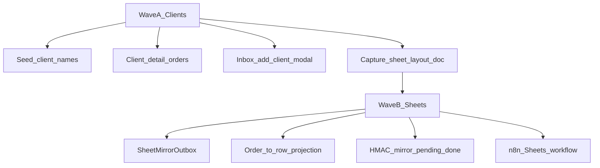

# CS Automation Phase 5 Implementation Plan

> **For agentic workers:** REQUIRED SUB-SKILL: Use superpowers:subagent-driven-development (recommended) or superpowers:executing-plans to implement this plan task-by-task. Steps use checkbox (`- [ ]`) syntax for tracking.

**Goal:** Seed and expose a usable client registry (list, detail with order buckets, inbox add-client modal), then mirror order state one-way from PostgreSQL to the production Google Sheet via an outbox + n8n — without AI and without making Sheets authoritative.

**Architecture:** Wave A extends the existing `Client` / `ClientIdentity` models and Next.js clients/inbox UI. Wave B adds `SheetMirrorOutbox`, transactional enqueue on order writes, HMAC pending/done APIs, and an inactive n8n Sheets workflow. PostgreSQL remains the only source of truth; Sheets is a one-way projection.

**Tech Stack:** Existing monorepo (Node 24, TypeScript strict, Next.js App Router, Prisma, PostgreSQL 18, Zod, Vitest) plus n8n Google Sheets nodes (transport only).

**Parent roadmap:** `docs/superpowers/plans/2026-07-26-cs-automation-full-roadmap.md` (Phase 5 summary).  
**Design:** `docs/specs/2026-07-26-cs-automation-design.md`.  
**Product decisions (this phase):** Client UX ships with Phase 5; Phase 4 AI remains deferred.

## Global Constraints

- Windows 10 Pro, PowerShell 5.1. Never use `&&`; chain with `;`.
- UNC only. Never `X:` or `Z:`.
- All timestamps UTC `timestamptz(6)`.
- TypeScript `strict`, `noUncheckedIndexedAccess`, `exactOptionalPropertyTypes`. `@typescript-eslint/no-explicit-any` is an error.
- No secrets in the repository. Spreadsheet IDs and OAuth tokens live in env / n8n credentials only.
- Conventional Commit after every task.
- **No AI / Ollama in this phase.**
- **Do not invent Google Sheet columns.** Wave B mirror code starts only after `docs/integrations/google-sheet-layout.md` records the live tab name, header row, and order-code key column.
- Sheets never writes into Postgres. Conflicts resolve in favour of the database.
- Reuse `createClient`, `resolveClientByEmail`, HMAC agent auth (`authenticateAgentRequest` / `signRequest`), and existing order lifecycle writers.

## Locked defaults

| Topic                                        | Decision                                                                        |
| -------------------------------------------- | ------------------------------------------------------------------------------- |
| Order bucket **Past**                        | `CLOSED`, `CANCELLED`                                                           |
| Order bucket **In production**               | `IN_PRODUCTION`                                                                 |
| Order bucket **Unassigned** (pre-production) | `DRAFT`, `ACKNOWLEDGED`, `AWAITING_ETA`, `ETA_SENT`                             |
| Client `code`                                | Derive from `displayName` (A–Z/0–9, length 2–12); collisions append `2`, `3`, … |
| Seed `folderName`                            | Equals `code` initially (no share existence check); CS rebinds later            |
| Seed identities                              | None unless already known                                                       |
| View clients                                 | `CS_LEAD` and `CS_EXECUTIVE` (`client:read`)                                    |
| Create/edit clients                          | `CS_LEAD` only (`client:manage`)                                                |
| Branch                                       | `feature/google-sheets-sync`                                                    |

## Seed display-name list (Wave A)

Use exactly these display names (idempotent seed; do not delete existing clients):

Affordable Golf, Amsale, BG, BH, Blink Imaging, Box Photographic, BR, Bradfords, CBI, Celtic, Chris C, Corporate Spec, David Burrow, David Burr, DGPB, Dhgf, DUW, Fashion Pass, FN, Fox R, Free Fly, FSA, Game Day, Gustav, Harbinger, HBLK, HN, HW, JC, JGleasure, Laings, Legendary, Meshki, MGG, Mustad, NBU, Ohpolly, Proper Cloth, R&C, Revelry, SHH, Silk Lavandaria, SJC & JAG, Spectrum, Sue Todd, Tefron, TL, TM, TYC, TYR, Untamed, Veronica, Vrly, Yeti, Yummie

## File structure (decomposition)

| Path                                                | Responsibility                                                 |
| --------------------------------------------------- | -------------------------------------------------------------- |
| `packages/shared/src/client-code.ts`                | Pure `deriveClientCode` + `allocateUniqueClientCode`           |
| `packages/db/prisma/seed-clients.ts`                | Idempotent client name seed invoked from `seed.ts`             |
| `apps/web/src/lib/clients/buckets.ts`               | Map `OrderStatus` → Past / InProduction / Unassigned           |
| `apps/web/src/lib/clients/service.ts`               | Existing create/resolve; optional `addClientIdentity` if cheap |
| `apps/web/src/lib/auth/rbac.ts`                     | Add `client:read` for executives                               |
| `apps/web/src/app/(app)/clients/page.tsx`           | List with bucket counts + links                                |
| `apps/web/src/app/(app)/clients/[id]/page.tsx`      | Detail + three order sections                                  |
| `apps/web/src/app/(app)/inbox/add-client-modal.tsx` | Client modal UI                                                |
| `apps/web/src/app/(app)/inbox/actions.ts`           | `createClientFromInboxAction`                                  |
| `docs/integrations/google-sheet-layout.md`          | Live layout capture (Wave B gate)                              |
| `apps/web/src/lib/sheets/*`                         | Outbox enqueue, claim, projection, done                        |
| `apps/web/src/app/api/mirror/**`                    | HMAC pending / done                                            |
| `n8n/workflows/google-sheets-mirror.json`           | Inactive transport workflow                                    |
| `scripts/reconcile-sheet-mirror.mjs`                | Operator reconciliation                                        |



## Entry Gate

| #   | Requirement                                                                                                 | Wave                        |
| --- | ----------------------------------------------------------------------------------------------------------- | --------------------------- |
| 0   | Phase 3 ingest/outbound dry-run path works on pilot Gmail                                                   | Before Wave A               |
| 1   | `docs/integrations/google-sheet-layout.md` filled from the **live** sheet (tab, headers, order-code column) | Before Wave B Tasks 5.6–5.9 |

If gate 1 is missing: complete Wave A, write a stub layout doc that states “NOT CAPTURED — mirror blocked”, and **stop before** schema/API/n8n mirror implementation. Do not invent production columns.

---

### Task 5.1: Client code helpers

**Files:**

- Create: `packages/shared/src/client-code.ts`
- Create: `packages/shared/src/client-code.test.ts`
- Modify: `packages/shared/src/index.ts` (export helpers)

**Interfaces:**

- Produces:
  - `deriveClientCode(displayName: string): string` — strips non-alphanumeric, uppercases, truncates/pads to length 2–12 (if empty after strip, use `"CLIENT"` truncated rules: prefer first letters of words then fill).
  - `allocateUniqueClientCode(base: string, existingCodes: ReadonlySet<string>): string` — if `base` free return it; else `base` truncated to allow suffix `2`…`N` within 12 chars.

- [ ] **Step 1: Write the failing tests**

```ts
import { describe, expect, it } from "vitest";
import { allocateUniqueClientCode, deriveClientCode } from "./client-code.js";

describe("deriveClientCode", () => {
  it("derives alphanumeric codes from messy names", () => {
    expect(deriveClientCode("R&C")).toMatch(/^[A-Z0-9]{2,12}$/);
    expect(deriveClientCode("SJC & JAG")).toMatch(/^[A-Z0-9]{2,12}$/);
    expect(deriveClientCode("Vrly")).toBe("VRLY");
    expect(deriveClientCode("Affordable Golf").length).toBeLessThanOrEqual(12);
  });
});

describe("allocateUniqueClientCode", () => {
  it("appends numeric suffixes on collision", () => {
    const existing = new Set(["BR", "BR2"]);
    expect(allocateUniqueClientCode("BR", existing)).toBe("BR3");
  });
});
```

- [ ] **Step 2: Run tests — expect FAIL**

Run: `npx vitest run packages/shared/src/client-code.test.ts`  
Expected: FAIL (module missing)

- [ ] **Step 3: Implement helpers**

Implement `deriveClientCode` / `allocateUniqueClientCode` in `packages/shared/src/client-code.ts` and export from `index.ts`.

- [ ] **Step 4: Run tests — expect PASS**

Run: `npx vitest run packages/shared/src/client-code.test.ts`  
Expected: PASS

- [ ] **Step 5: Commit**

```bash
git add packages/shared/src/client-code.ts packages/shared/src/client-code.test.ts packages/shared/src/index.ts
git commit -m "feat(shared): add client code derivation helpers for Phase 5 seed"
```

---

### Task 5.2: Idempotent client seed

**Files:**

- Create: `packages/db/prisma/seed-clients.ts`
- Modify: `packages/db/prisma/seed.ts` (call seed clients after admin user)
- Test: `packages/db/src/seed-clients.test.ts` (or vitest under packages/db if pattern exists; otherwise `apps/web` integration test hitting prisma after seed function export)

**Interfaces:**

- Consumes: `deriveClientCode`, `allocateUniqueClientCode` from `@cs/shared`
- Produces: `seedClients(prisma: PrismaClient): Promise<{ created: number; skipped: number }>`
  - Skip when `displayName` already exists (case-insensitive) **or** when derived code already bound to same display name.
  - Never delete clients or orders.
  - `folderName = code` on create.

- [ ] **Step 1: Write failing seed idempotency test**

Assert two runs of `seedClients` leave the same client count for the fixed name list and do not throw on unique conflicts.

- [ ] **Step 2: Run test — expect FAIL**

- [ ] **Step 3: Implement `seed-clients.ts` + wire `seed.ts`**

Include the full display-name list from [Seed display-name list](#seed-display-name-list-wave-a).

- [ ] **Step 4: Run test — expect PASS**; optionally run seed against test DB:

```powershell
Get-Content .env.test | ForEach-Object { if ($_ -match '^\s*([^#][^=]+)=(.*)$') { Set-Item -Path "Env:$($matches[1].Trim())" -Value $matches[2].Trim().Trim('"') } }
npm run db:seed
```

- [ ] **Step 5: Commit**

```bash
git add packages/db/prisma/seed-clients.ts packages/db/prisma/seed.ts packages/db/src/seed-clients.test.ts
git commit -m "feat(db): idempotent seed of Phase 5 client display names"
```

---

### Task 5.3: RBAC `client:read` + order buckets helper

**Files:**

- Modify: `apps/web/src/lib/auth/rbac.ts`
- Create: `apps/web/src/lib/clients/buckets.ts`
- Create: `apps/web/src/lib/clients/buckets.test.ts`
- Modify: existing rbac tests if present

**Interfaces:**

- Produces:
  - Permission `"client:read"` on `CS_EXECUTIVE` and `CS_LEAD`
  - `export const PAST_ORDER_STATUSES = ["CLOSED", "CANCELLED"] as const`
  - `export const IN_PRODUCTION_ORDER_STATUSES = ["IN_PRODUCTION"] as const`
  - `export const UNASSIGNED_ORDER_STATUSES = ["DRAFT", "ACKNOWLEDGED", "AWAITING_ETA", "ETA_SENT"] as const`
  - `bucketForOrderStatus(status: OrderStatus): "past" | "inProduction" | "unassigned"`

- [ ] **Step 1: Write failing bucket + rbac tests**
- [ ] **Step 2: Run — expect FAIL**
- [ ] **Step 3: Implement**
- [ ] **Step 4: Run — expect PASS**
- [ ] **Step 5: Commit**

```bash
git commit -m "feat(web): client:read permission and order status buckets"
```

---

### Task 5.4: Clients list + detail UI

**Files:**

- Modify: `apps/web/src/app/(app)/clients/page.tsx`
- Create: `apps/web/src/app/(app)/clients/[id]/page.tsx`
- Create: `apps/web/src/app/(app)/clients/[id]/loading.tsx`
- Create: `apps/web/src/app/(app)/clients/[id]/error.tsx`
- Modify: `apps/web/src/app/(app)/layout.tsx` only if nav label needs update
- Modify: list page auth from `assertCan(..., "client:manage")` to `assertCan(..., "client:read")`; keep New client button gated by `can(..., "client:manage")`

**Behaviour:**

- List: code, displayName, folderName, counts for past / inProduction / unassigned, link to `/clients/[id]`.
- Detail: identities, three order sections with links to `/orders/[id]`.
- Loading / empty / error states required.

- [ ] **Step 1: Implement pages (manual UI smoke after seed)**
- [ ] **Step 2: Add a focused server/component test if the repo has a pattern; otherwise cover bucket counts via a small query helper unit test**
- [ ] **Step 3: Commit**

```bash
git commit -m "feat(web): client list bucket counts and client detail order sections"
```

---

### Task 5.5: Inbox “Add new client” modal

**Files:**

- Modify: `apps/web/src/app/(app)/inbox/review-actions.tsx`
- Create: `apps/web/src/app/(app)/inbox/add-client-modal.tsx`
- Modify: `apps/web/src/app/(app)/inbox/actions.ts`
- Modify: `apps/web/src/app/(app)/inbox/[emailId]/page.tsx` (pass `fromAddress` / email id as needed)
- Test: `apps/web/src/app/(app)/inbox/actions.test.ts` (extend or create)

**Interfaces:**

- Produces: `createClientFromInboxAction(prev, formData) => Promise<{ error: string | null; clientId?: string }>`
  - Requires `client:manage`
  - Fields: `displayName`, `code` (optional → derive), `folderName` (default code), `address` (default inbound fromAddress)
  - Calls `createClient`
  - `revalidatePath("/inbox")`, `revalidatePath("/clients")`, `revalidatePath(\`/inbox/${emailId}\`)`

**UI:**

- When `!proposedClientId`: badge “New client” + button “Add new client”.
- Modal: suggest code via `deriveClientCode`; submit creates client; on success close modal and set select value to new id (prefer `router.refresh()` + defaultValue from returned id via searchParam or controlled select).

- [ ] **Step 1: Write failing action test (create client + ADDRESS identity from fromAddress)**
- [ ] **Step 2: Run — expect FAIL**
- [ ] **Step 3: Implement action + modal + review-actions wiring**
- [ ] **Step 4: Run tests — expect PASS**
- [ ] **Step 5: Commit**

```bash
git commit -m "feat(web): inbox modal to register unknown senders as clients"
```

---

### Task 5.6: Wave A docs + verify

**Files:**

- Modify: `docs/implementation-status.md` (Phase 5 Wave A in progress / clients complete)
- Create: `docs/decisions/0008-phase5-clients-before-sheets.md` (short ADR: clients UX ships in Phase 5; AI deferred; Sheets gated on layout capture)

- [ ] **Step 1: Update docs**
- [ ] **Step 2: Run full verify**

```powershell
Remove-Item Env:DATABASE_URL -ErrorAction SilentlyContinue
Get-Content .env.test | ForEach-Object { if ($_ -match '^\s*([^#][^=]+)=(.*)$') { Set-Item -Path "Env:$($matches[1].Trim())" -Value $matches[2].Trim().Trim('"') } }
npm run verify
```

Expected: typecheck, lint, format, tests, build all green.

- [ ] **Step 3: Commit**

```bash
git commit -m "docs: record Phase 5 Wave A client registry delivery"
```

**Wave A acceptance checkpoint:** stop and confirm with operator before Wave B if layout doc is not captured.

---

### Task 5.7: Capture Google Sheet layout (Wave B gate)

**Files:**

- Create: `docs/integrations/google-sheet-layout.md`

**Required contents (no secrets):**

- Tab name
- Header row (exact column titles left-to-right)
- Which column stores order code (unique key for update-or-append)
- Append vs update rules
- Note: spreadsheet ID from env `GOOGLE_SHEETS_SPREADSHEET_ID` (not committed)
- Capture date + operator

- [ ] **Step 1: Operator fills layout from live sheet**
- [ ] **Step 2: Commit doc only after real capture**

```bash
git commit -m "docs: capture live Google Sheet layout for Phase 5 mirror"
```

If not captured: write file with status `BLOCKED — layout not captured` and **do not continue Tasks 5.8–5.11**.

---

### Task 5.8: `SheetMirrorOutbox` schema + enqueue helper

**Files:**

- Modify: `packages/db/prisma/schema.prisma`
- Create: `packages/db/prisma/migrations/<timestamp>_sheet_mirror_outbox/migration.sql`
- Create: `apps/web/src/lib/sheets/outbox.ts`
- Create: `apps/web/src/lib/sheets/outbox.test.ts`
- Modify: order write sites (`createOrder`, lifecycle status/ETA, proposal approve path as needed) to call `enqueueSheetMirror` inside the same transaction

**Interfaces:**

- Produces:
  - Prisma model `SheetMirrorOutbox` with `id`, `orderId`, `operation` (`UPSERT`), `payload` `Json`, `status` (`PENDING` | `CLAIMED` | `DONE` | `FAILED`), `attempts`, `lastError`, `dispatchedAt`, `createdAt`, `updatedAt`
  - `enqueueSheetMirror(db, { orderId, correlationId }): Promise<void>` — loads order projection inputs and inserts PENDING row

- [ ] **Step 1: Write failing enqueue test**
- [ ] **Step 2: Migration + implement enqueue**
- [ ] **Step 3: Wire into transactional order writers**
- [ ] **Step 4: Tests PASS + migrate test DB**
- [ ] **Step 5: Commit**

```bash
git commit -m "feat(db): SheetMirrorOutbox and transactional enqueue"
```

---

### Task 5.9: Projection + HMAC mirror APIs

**Files:**

- Create: `apps/web/src/lib/sheets/project.ts` (+ test using layout fixture copied from layout doc)
- Create: `apps/web/src/lib/sheets/claim.ts` (+ test)
- Create: `apps/web/src/app/api/mirror/pending/route.ts`
- Create: `apps/web/src/app/api/mirror/[id]/done/route.ts`
- Create: `apps/web/src/app/api/mirror/mirror-routes.test.ts`

**Interfaces:**

- `projectOrderToSheetRow(order): Record<string, string>` — keys = exact header titles from layout doc
- `claimPendingMirror(db, limit): Promise<MirrorClaim[]>` — FOR UPDATE SKIP LOCKED pattern like outbound
- `markMirrorDone(db, { id, providerRowKey })` — idempotent DONE
- GET `/api/mirror/pending?limit=` HMAC only
- POST `/api/mirror/:id/done` HMAC only, JSON body `{ providerRowKey: string }`

- [ ] **Step 1: Failing projection + route tests**
- [ ] **Step 2: Implement**
- [ ] **Step 3: Tests PASS**
- [ ] **Step 4: Commit**

```bash
git commit -m "feat(web): HMAC Google Sheets mirror pending and done APIs"
```

---

### Task 5.10: n8n Sheets workflow export

**Files:**

- Create: `n8n/workflows/google-sheets-mirror.json` (`active: false`)
- Modify: `docs/integrations/google-sheet-layout.md` (dry-run steps) or create `docs/integrations/n8n-google-sheets.md`

**Workflow shape:** Schedule → Sign → GET pending → Split → Google Sheets update-or-append by order code column → Sign done → POST done.

Credential placeholder name: `SHARED_CS_GOOGLE_SHEETS_OAUTH` (non-secret).

- [ ] **Step 1: Author inactive export matching HMAC patterns from `gmail-send.json`**
- [ ] **Step 2: Document dry-run checklist**
- [ ] **Step 3: Commit**

```bash
git commit -m "feat(n8n): inactive Google Sheets mirror workflow export"
```

---

### Task 5.11: Reconciliation + Phase 5 verify

**Files:**

- Create: `scripts/reconcile-sheet-mirror.mjs` (reads DB orders; prints codes missing from a CSV/export path OR documents manual compare steps if Sheets API not in-process)
- Modify: `docs/implementation-status.md` (Phase 5 complete when Wave B acceptance met)
- Modify: `.env.example` with `GOOGLE_SHEETS_SPREADSHEET_ID=` placeholder only

- [ ] **Step 1: Add reconciliation script + docs**
- [ ] **Step 2: `npm run verify`**

```powershell
Remove-Item Env:DATABASE_URL -ErrorAction SilentlyContinue
Get-Content .env.test | ForEach-Object { if ($_ -match '^\s*([^#][^=]+)=(.*)$') { Set-Item -Path "Env:$($matches[1].Trim())" -Value $matches[2].Trim().Trim('"') } }
npm run verify
```

- [ ] **Step 3: Commit**

```bash
git commit -m "chore: Phase 5 Sheets reconciliation and status sign-off"
```

---

## Acceptance criteria

**Wave A**

- [ ] Seed list loads idempotently with unique codes and `folderName = code`.
- [ ] `/clients` shows bucket counts; `/clients/[id]` lists Past / In production / Unassigned.
- [ ] Unknown inbox sender shows New client + modal; after create, ADDRESS resolves and client is selectable.
- [ ] Executives can view; only leads create.
- [ ] No AI; no Sheets writes.

**Wave B**

- [ ] Layout doc matches live sheet.
- [ ] Order changes enqueue outbox in the same transaction.
- [ ] HMAC pending/done + n8n dry-run update sheet by order code without duplicates.
- [ ] Outage leaves PENDING rows that drain when n8n returns.
- [ ] Sheet never writes Postgres.

## Out of scope

- Phase 4 Ollama / `OrderExtractor`
- Making Google Sheets a write source
- File Agent / download adapter changes
- Automatic share-folder creation for seeded clients
- Full client identity CRUD beyond inbox create + existing `/clients/new`

## Risks

- Seed `folderName = code` may not match real UNC folders until CS rebinds — filesystem jobs fail until fixed.
- Wave B blocked without live layout capture.
- Short-name collisions (`BR`, `FN`) require tested suffix allocation.
